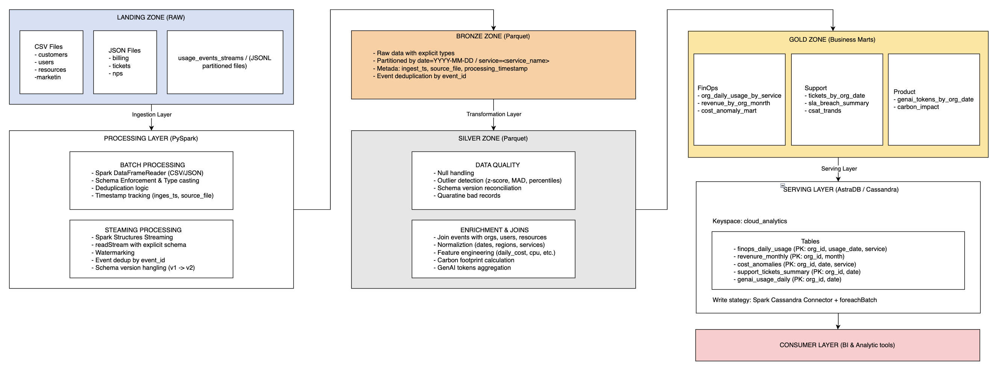
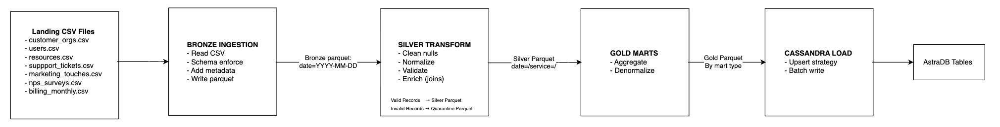
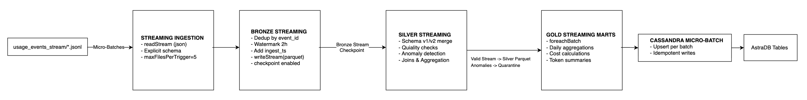

# Diseño Final - Cloud Provider Analytics
## ETL + Streaming + Serving en Cassandra

**Fecha:** 4 de Diciembre 2025  
**Versión:** 2.0 - Diseño Final \
**Autor:** Nicolás Rossi y Juan Ramiro Castro

---

## Tabla de Contenidos
1. [Diagrama de Arquitectura de Alto Nivel](#1-diagrama-de-arquitectura-de-alto-nivel)
2. [Mapeo de Requisitos a Componentes](#2-mapeo-de-requisitos-a-componentes)
3. [Flujo de Datos (Data Pipeline)](#3-flujo-de-datos-data-pipeline)
4. [Asunciones y Riesgos](#4-asunciones-y-riesgos-iniciales)
5. [Estimación de Esfuerzo y Recursos](#5-estimación-de-esfuerzo-y-recursos)
6. [Resumen de Implementación](#6-resumen-de-implementación)
7. [Anexo A: Tablas Cassandra (Query-First)](#anexo-a-tablas-cassandra-query-first---implementación-final)
8. [Anexo B: Decisiones Técnicas y Trade-offs](#anexo-b-decisiones-técnicas-y-trade-offs-implementación-final)

---

## 1. Diagrama de Arquitectura de Alto Nivel

### 1.1 Arquitectura General



### 1.2 Patrón Arquitectónico Elegido: **Lambda Architecture**

**Justificación:**
La arquitectura Lambda se adopta por la coexistencia de dos naturalezas de datos en el proyecto: (i) lotes periódicos y maestros (customers, users, resources, billing, NPS, tickets) cuyo procesamiento óptimo es batch; y (ii) eventos de uso (usage events) que exigen baja latencia y tratamiento continuo vía streaming

1. **Naturaleza Dual de los Datos:**
   - **Batch Layer:** Datos maestros (customers, users, resources) y datos periódicos (billing, NPS, tickets) son inherentemente batch
   - **Speed Layer:** Eventos de uso (`usage_events_stream`) requieren procesamiento near-real-time

2. **Requisitos del Negocio:**
   - FinOps necesita métricas operativas en tiempo real para detección de anomalías
   - Facturación y CRM se actualizan mensualmente/diariamente (batch es suficiente)

3. **Trade-offs Aceptados:**
   - Dos pipelines separados (batch + streaming) vs. uno unificado
   - Complejidad de sincronización en Gold layer
   - Mitigación: Idempotencia garantizada y checkpoint management

**Por qué Lambda y no Kappa (todo streaming):**
- Naturaleza de los datos batch: Re-streamear CSV estáticos (maestros y facturación) añade complejidad operativa sin beneficio: su cadencia diaria/mensual se modela mejor como jobs batch.
- Eficiencia operativa: Mantener un único stream para todo fuerza state management y replay innecesarios; con Lambda, cada dominio usa el modo de cómputo más natural.
- Coste/latencia adecuados: Batch ofrece mayor throughput para reprocesos históricos;

---

## 2. Mapeo de Requisitos a Componentes

### 2.1 Análisis de las 5 Vs del Big Data

| **V**        | **Característica del Proyecto**                                        | **Estrategia de Solución**                                  |
|--------------|------------------------------------------------------------------------|-------------------------------------------------------------|
| **Volume**   | ~100 archivos JSONL particionados, múltiples CSV, crecimiento diario   | Particionado Parquet, procesamiento paralelo con Spark      |
| **Velocity** | Near real-time streaming events + batch diario/mensual                 | Arquitectura Lambda: Streaming + Batch layers               |
| **Variety**  | CSV estructurado, JSONL semi-estructurado, evolución de schema (v1/v2) | Schema enforcement, schema evolution handling, type casting |
| **Veracity** | Nulos, outliers, valores negativos, inconsistencias, ruido             | Data quality rules, quarantine zone, detección de anomalias |
| **Value**    | Insights para FinOps, Soporte, Producto/GenAI                          | Business-oriented marts en Gold zone, query-first design    |

### 2.2 Mapeo de Requisitos Técnicos

| **Requisito del Proyecto**            | **Componente Técnico**          | **Implementación Real**                                          |
|---------------------------------------|---------------------------------|------------------------------------------------------------------|
| Procesamiento distribuido de big data | Processing engine               | **PySpark 3.5.0** con Java 17 en Google Colab                    |
| Ingesta batch de CSV/JSON             | Batch ingestion layer           | `spark.read.csv()` con schemas explícitos (7 datasets)           |
| Ingesta streaming de eventos          | Streaming ingestion layer       | **Spark Structured Streaming** con schema superset (v1+v2)       |
| Almacenamiento intermedio escalable   | Bronze/Silver/Gold zones        | **Parquet** en Google Drive (compresión snappy)                  |
| Deduplicación de eventos              | Dedup logic                     | `dropDuplicates(["event_id"])` en procesamiento streaming        |
| Manejo de late data                   | Watermarking                    | `withWatermark("event_ts", "2 hours")` (configurado, no probado) |
| Schema evolution (v1 → v2)            | Schema handling                 | Schema superset con campos v2 (`genai_tokens`, `carbon_kg`)     |
| Data quality y detección de anomalías | Quality rules engine            | **MAD** (Median Absolute Deviation) con threshold 3.5            |
| Normalización y joins                 | Transformation layer (Silver)   | LEFT JOIN con 3 dimensiones: orgs, users, resources              |
| Serving layer (queries rápidas)       | NoSQL database                  | **AstraDB** (Cassandra-as-a-Service) free tier                   |
| Carga a Cassandra                     | Cassandra connector             | `spark-cassandra-connector_2.12:3.5.0` con Secure Connect Bundle |
| Idempotencia en re-procesamiento      | Checkpointing + upsert strategy | Checkpoints en Google Drive + PKs compuestas en Cassandra        |
| Diseño query-first para BI            | Marts denormalizados            | 6 tablas denormalizadas por patrón de query                      |
| Seguridad y autenticación             | Secrets management              | Colab secrets para `ASTRA_CLIENT_ID` y `ASTRA_CLIENT_SECRET`     |

### 2.3 Componentes por Zona del Data Lake

| **Zona**       | **Propósito**                                  | **Formato**    | **Particionamiento**           |
|----------------|------------------------------------------------|----------------|--------------------------------|
| **Landing**    | Archivos raw inmutables                        | CSV, JSONL     | Por fuente (directorio)        |
| **Bronze**     | Datos tipificados con metadata de ingesta      | Parquet        | `date=YYYY-MM-DD` (solo events)|
| **Silver**     | Datos limpios, conformados y enriquecidos      | Parquet        | `date=YYYY-MM-DD`              |
| **Gold**       | Marts analíticos por dominio                   | Parquet        | Por caso de uso                |
| **Quarantine** | Registros rechazados por quality rules         | Parquet        | `date=` + `error_type=`        |

---

## 3. Flujo de Datos (Data Pipeline)

### 3.1 Pipeline Batch (Maestros y Facturación)



### 3.2 Pipeline Streaming (Usage Events)



### 3.3 Transformaciones Silver Layer

| **Transformación**                  | **Input**                     | **Output**                            | **Lógica Implementada**                                               |
|-------------------------------------|-------------------------------|---------------------------------------|-----------------------------------------------------------------------|
| Reconciliación de esquema           | events (v1 y v2)              | unified_events                        | Schema superset: columnas nuevas (`genai_tokens`, `carbon_kg`) → NULL para v1 |
| Conversión temporal                 | event_timestamp               | event_ts (timestamp)                  | `to_timestamp(event_timestamp)` para operaciones temporales           |
| Extracción de fecha                 | event_ts                      | usage_date (date)                     | `to_date(event_ts)` para particionamiento y agregaciones              |
| Validación de costos                | cost_usd_increment            | cost_usd (limpio)                     | Filtrar `cost_usd >= -0.01` (permitir ajustes mínimos negativos)     |
| Enriquecimiento de organización     | org_id                        | org_name, industry, plan, org_region  | `LEFT JOIN` con **customers_orgs** en Bronze                          |
| Enriquecimiento de usuario          | user_id                       | user_email, user_role, user_status    | `LEFT JOIN` con **users** en Bronze                                   |
| Enriquecimiento de recurso          | resource_id                   | resource_name, resource_type          | `LEFT JOIN` con **resources** en Bronze                               |
| Normalización de servicio           | service (raw)                 | service (lowercase, trimmed)          | `lower(trim(service))` para consistencia                              |
| Normalización de región             | region (raw)                  | region (lowercase, trimmed)           | `lower(trim(region))` + mapeo futuro a códigos ISO                    |
| Cálculo de tokens por request       | genai_tokens, requests        | avg_tokens_per_request                | `genai_tokens / NULLIF(requests, 0)` con manejo de división por cero  |

### 3.4 Transformaciones Gold Layer (Marts Analíticos)

| **Mart**                            | **Agregación Principal**                  | **Lógica de Negocio**                                                      |
|-------------------------------------|-------------------------------------------|---------------------------------------------------------------------------|
| **finops_daily_usage**              | GROUP BY org_id, date, service            | SUM(cost), COUNT(requests), detección de anomalías con MAD               |
| **org_service_cost_summary**        | Ventanas temporales (1d, 7d, 14d)         | Ranking de servicios por costo acumulado usando `dense_rank()`          |
| **support_tickets_summary**         | GROUP BY org_id, date, severity           | COUNT(tickets), AVG(csat), COUNT(sla_breach)                             |
| **revenue_monthly**                 | GROUP BY org_id, billing_month            | net_revenue = (subtotal + taxes - credits) × exchange_rate               |
| **genai_usage_daily**               | GROUP BY org_id, date WHERE service=genai | SUM(tokens), COUNT(requests), AVG(tokens/request)                        |
| **carbon_footprint_daily**          | GROUP BY org_id, date WHERE carbon_kg > 0 | SUM(carbon_kg), COUNT(events) para métrica de sostenibilidad            |

**Detección de Anomalías (MAD - Median Absolute Deviation):**
```python
# Método robusto ante outliers extremos
MAD = median(|cost - median(cost)|)
anomaly_score = |cost - median(cost)| / (MAD × 1.4826)
is_anomaly = anomaly_score > 3.5
```
**Justificación:** MAD es más robusto que Z-score cuando existen valores extremos, evitando falsos positivos.

---

## 4. Asunciones y Riesgos Iniciales

### 4.1 Asunciones

| **ID** | **Asunción**                                                                | **Impacto si es falsa**                                     | **Validación**                          |
|--------|-----------------------------------------------------------------------------|-------------------------------------------------------------|-----------------------------------------|
| A1     | Volumen de eventos < 10M registros/día                                      | Requiere optimización adicional (coalesce, cache)          | Analizar tamaño de archivos landing     |
| A2     | Schema evolution solo 2 versiones (v1 → v2), no más cambios                 | Lógica más compleja de reconciliación                       | Confirmar con stakeholders              |
| A3     | Late data arrival máximo 2 horas después del event_timestamp                | Ajustar watermark (mayor latencia o pérdida de datos)      | Analizar timestamps en archivos         |
| A4     | Archivos JSONL correctamente formateados (un JSON por línea)                | Requiere pre-procesamiento adicional                        | Validar parsing de muestras             |
| A5     | Idempotencia por natural keys (org_id + date + service) es suficiente       | Requiere surrogate keys o versionado                        | Diseñar pruebas de re-ejecución         |

### 4.2 Riesgos

| **ID** | **Riesgo**                                           | **Probabilidad** | **Impacto** | **Mitigación**                                                                 |
|--------|------------------------------------------------------|------------------|-------------|--------------------------------------------------------------------------------|
| R1     | Datos históricos incompletos o inconsistentes       | Alta             | Medio       | EDA exhaustivo, documentar gaps, aplicar reglas de quality estrictas           |
| R2     | Late data > watermark (pérdida de eventos)           | Media            | Medio       | Monitorear late data metrics, alertas, ajustar watermark iterativamente        |
| R3     | Joins con baja cardinalidad (muchos nulls)           | Media            | Medio       | LEFT JOINs + coalesce con defaults, documentar % de matches                    |
| R4     | Outliers extremos distorsionando anomaly detection   | Alta             | Medio       | Usar MAD (más robusto), percentiles, caps en valores extremos                  |

### 5.1 Equipo y Roles

Equipo: 
- Nicolás Rossi
- Juan Ramiro Castro

| **Rol**           | **Responsabilidades**                                        | **Tiempo Estimado** |
|-------------------|--------------------------------------------------------------|---------------------|
| **Data Engineer** | Arquitectura, Spark streaming, Cassandra design, code review | 40 horas            |
|                   | Batch pipelines, Bronze/Silver transformations               | 20 horas            |
|                   | Gold marts, SQL optimization, business logic,                | 20 horas            |
|                   | EDA, data profiling, testing queries, documentation          | 20 horas            |

**Total Esfuerzo:** ~100 horas (2.5 semanas)


### 5.2 Recursos Técnicos

| **Recurso**                      | **Especificación Implementada**                                 |
|----------------------------------|-----------------------------------------------------------------|
| **Compute**                      | Google Colab (Python 3.10, 12GB RAM)                            |
| **Spark**                        | PySpark 3.5.0 y Java 17                                         |
| **Storage (Landing)**            | Google Drive montado en `/content/drive/MyDrive/big-data-final` |
| **Storage (Bronze/Silver/Gold)** | Parquet en Google Drive (formato columnar comprimido)           |
| **Database (AstraDB)**           | Free tier: 40GB storage, 40M reads, 20M writes/mes              |
| **Conectividad**                 | `spark-cassandra-connector_2.12:3.5.0` + Secure Connect Bundle  |
| **Autenticación**                | Client ID/Secret almacenados como Colab secrets                 |

### 5.3 Roadmap y entregables

| **Hito**                   | **Entregable**                                 | **Criterio de Éxito**                                |
|----------------------------|------------------------------------------------|------------------------------------------------------|
| M1: Bronze Complete        | Bronze Parquet (batch + streaming) con metadata | 100% de archivos ingestados, schema validado         |
| M2: Silver Complete        | Silver Parquet con datos limpios y enriquecidos | <10% registros en quarantine, joins con >80% matches |
| M3: Gold Marts             | Marts de FinOps, Soporte, Producto en Parquet  | KPIs calculados correctamente vs. datos raw          |
| M4: Cassandra Integration  | Datos cargados en AstraDB, queries funcionando | 5 queries mínimas ejecutándos                        |
| M5: Testing & Docs         | Tests, documentación completa, demo funcional  | 0 bugs críticos, docs revisadas                      |
| M6: Entrega Final          | Notebook ejecutable, video, presentación       | Todos los requisitos del proyecto cumplidos          |

---

## Anexo A: Tablas Cassandra (Query-First)

### Tabla 1: `finops_daily_usage` - Costos y requests diarios por org y servicio
```cql
CREATE TABLE IF NOT EXISTS cloud_analytics.finops_daily_usage (
    org_id TEXT,
    usage_date DATE,
    service TEXT,
    total_cost_usd DECIMAL,
    total_requests BIGINT,
    total_tokens BIGINT,
    total_carbon_kg DECIMAL,
    is_anomaly BOOLEAN,
    anomaly_score DOUBLE,
    PRIMARY KEY ((org_id), usage_date, service)
) WITH CLUSTERING ORDER BY (usage_date DESC, service ASC)
  AND default_time_to_live = 7776000;  -- 90 días
```

### Tabla 2: `org_service_cost_summary` - Top-N servicios por costo acumulado
```cql
CREATE TABLE IF NOT EXISTS cloud_analytics.org_service_cost_summary (
    org_id TEXT,
    summary_date DATE,
    service TEXT,
    cost_14d DECIMAL,
    cost_7d DECIMAL,
    cost_1d DECIMAL,
    rank_14d INT,
    PRIMARY KEY ((org_id, summary_date), rank_14d, service)
) WITH CLUSTERING ORDER BY (rank_14d ASC);
```
**Notas:**
- Partition key compuesta `(org_id, summary_date)` para distribuir carga
- Ranking basado en ventanas temporales de 1, 7 y 14 días
- Filtrado a Top-10 por organización

### Tabla 3: `support_tickets_summary` - Evolución de tickets y CSAT
```cql
CREATE TABLE IF NOT EXISTS cloud_analytics.support_tickets_summary (
    org_id TEXT,
    ticket_date DATE,
    severity TEXT,
    total_tickets INT,
    avg_csat DECIMAL,
    sla_breaches_count INT,
    PRIMARY KEY ((org_id), ticket_date, severity)
) WITH CLUSTERING ORDER BY (ticket_date DESC);
```

### Tabla 4: `revenue_monthly` - Facturación mensual
```cql
CREATE TABLE IF NOT EXISTS cloud_analytics.revenue_monthly (
    org_id TEXT,
    billing_month DATE,
    currency TEXT,
    total_due_local DECIMAL,
    credits_applied DECIMAL,
    tax_amount DECIMAL,
    net_revenue DECIMAL,
    PRIMARY KEY ((org_id), billing_month)
) WITH CLUSTERING ORDER BY (billing_month DESC);
```
### Tabla 5: `genai_usage_daily` - Tokens y uso de GenAI
```cql
CREATE TABLE IF NOT EXISTS cloud_analytics.genai_usage_daily (
    org_id TEXT,
    usage_date DATE,
    total_tokens BIGINT,
    total_requests INT,
    total_cost_usd DECIMAL,
    avg_tokens_per_request INT,
    PRIMARY KEY ((org_id), usage_date)
) WITH CLUSTERING ORDER BY (usage_date DESC);
```

### Tabla 6: `carbon_footprint_daily` - Huella de carbono
```cql
CREATE TABLE IF NOT EXISTS cloud_analytics.carbon_footprint_daily (
    org_id TEXT,
    usage_date DATE,
    total_carbon_kg DECIMAL,
    events_with_carbon_data INT,
    PRIMARY KEY ((org_id), usage_date)
) WITH CLUSTERING ORDER BY (usage_date DESC);
```
**Nueva tabla agregada:**
- Métrica de sostenibilidad no planificada originalmente
- Calcula emisiones de carbono agregadas por organización y día
- Solo disponible para eventos con `schema_version=2`

### Queries Implementadas sobre AstraDB

#### Query 1: Costos y Requests Diarios por Org/Servicio (Últimos 30 días)
```sql
SELECT
    org_id,
    usage_date,
    service,
    total_cost_usd,
    total_requests,
    is_anomaly,
    anomaly_score
FROM cloud_analytics.finops_daily_usage
WHERE org_id = '<sample_org>'
  AND usage_date >= date_sub('<snapshot_date>', 30)
ORDER BY usage_date DESC, total_cost_usd DESC
```
**Uso:** Análisis de tendencias de costo por servicio, detección de anomalías en consumo.

#### Query 2: Top-10 Servicios por Costo Acumulado (Ventanas 1d/7d/14d)
```sql
SELECT
    org_id,
    service,
    rank_14d,
    cost_14d,
    cost_7d,
    cost_1d
FROM cloud_analytics.org_service_cost_summary
WHERE org_id = '<sample_org>'
  AND summary_date = '<max_date>'
  AND rank_14d <= 10
ORDER BY rank_14d ASC
```
**Uso:** Priorización de optimización de costos, identificación de servicios de mayor impacto.

#### Query 3: Evolución de Tickets de Soporte por Severidad
```sql
SELECT
    org_id,
    ticket_date,
    severity,
    total_tickets,
    sla_breaches_count,
    avg_csat
FROM cloud_analytics.support_tickets_summary
WHERE org_id = '<sample_org>'
  AND ticket_date >= date_sub('<snapshot_date>', 30)
ORDER BY ticket_date DESC
```
**Uso:** Monitoreo de calidad de soporte, análisis de SLA compliance y satisfacción del cliente.

#### Query 4: Revenue Mensual con Desglose de Créditos/Impuestos
```sql
SELECT
    org_id,
    billing_month,
    currency,
    total_due_local,
    credits_applied,
    tax_amount,
    net_revenue
FROM cloud_analytics.revenue_monthly
WHERE org_id = '<sample_org>'
ORDER BY billing_month DESC
```
**Uso:** Análisis financiero, forecasting, cálculo de ARR (Annual Recurring Revenue).

#### Query 5: Uso de GenAI - Tokens y Costo Diario
```sql
SELECT
    org_id,
    usage_date,
    total_tokens,
    total_requests,
    total_cost_usd,
    avg_tokens_per_request
FROM cloud_analytics.genai_usage_daily
WHERE org_id = '<sample_org>'
  AND usage_date >= date_sub('<snapshot_date>', 30)
ORDER BY usage_date DESC
```
**Uso:** Tracking de adopción de servicios GenAI, análisis de eficiencia de uso de tokens.

#### Query 6: Huella de Carbono Diaria (Métrica de Sostenibilidad)
```sql
SELECT
    org_id,
    usage_date,
    total_carbon_kg,
    events_with_carbon_data,
    ROUND(total_carbon_kg / events_with_carbon_data, 4) as avg_carbon_per_event
FROM cloud_analytics.carbon_footprint_daily
WHERE org_id = '<sample_org>'
  AND usage_date >= date_sub('<snapshot_date>', 30)
ORDER BY usage_date DESC
```
**Uso:** Reporting de sostenibilidad corporativa, cálculo de compensaciones de carbono.

---

## Anexo B: Decisiones Técnicas y Trade-offs

| **Decisión**                                                      | **Alternativa considerada**                                    | **Trade-off**                                                                    | **Justificación técnica implementada**                                                                                                                                                                                      |
| ----------------------------------------------------------------- | -------------------------------------------------------------- | -------------------------------------------------------------------------------- |-----------------------------------------------------------------------------------------------------------------------------------------------------------------------------------------------------------------------------|
| **Patrón arquitectónico: Lambda**                                 | Kappa (todo *streaming*)                                       | Complejidad operativa vs. unificación de lógica                                  | **Implementado:** Batch para maestros (CSV) + Streaming para events (JSONL). Dos pipelines especializados con checkpointing independiente.                                                                                  |
| **Plataforma: Google Colab**                                      | Local Spark cluster, Databricks Community, AWS EMR             | Costo cero vs. recursos limitados (12GB RAM)                                     | **Implementado:** Colab con Google Drive storage. Suficiente para dataset académico (~100 archivos). Limitación: no escala a producción sin modificaciones.                                                                 |
| **Detección de anomalías: MAD**                                   | Z-score, IQR, Isolation Forest                                 | Robustez vs. complejidad                                                         | **Implementado:** MAD con threshold 3.5. Más robusto que Z-score ante outliers. Calcula mediana y desviación absoluta mediana por ventana de org/servicio.                                                                  |
| **Schema Evolution: Superset anticipado**                         | Schema inference dinámico, Schema registry externo             | Planificación previa vs. flexibilidad                                            | **Implementado:** Schema con todos los campos (v1 + v2) definido desde el inicio. Spark llena con NULL las columnas faltantes en eventos v1. Evita fallos de streaming por schema mismatch.                                 |
| **Particionamiento Parquet: Solo `date`**                         | `date + service`, `date + org_id`                              | Simplicidad vs. optimización de filtros                                          | **Implementado:** Partición única por `date` en Silver/Gold. Suficiente para volumen actual; evita small files problem. En producción: considerar `date + service` para mejor pushdown.                                     |
| **Idempotencia: Natural keys en Cassandra**                       | Surrogate keys + versionado, CDC con timestamps                | Simplicidad vs. control fino de versiones                                        | **Implementado:** PKs basadas en dimensiones de negocio (`org_id + date + service`). Mode "append" en carga inicial; re-ejecuciones requieren truncate o upsert logic con `cassandra.output.consistency.level=LOCAL_QUORUM` |
| **TTL: Solo en finops_daily_usage (90d)**                         | TTL en todas las tablas, sin TTL                               | Gestión automática vs. retención ilimitada                                       | **Implementado:** TTL de 7776000 seg (90 días) solo en tabla de mayor volumen (finops). Otras tablas sin TTL por naturaleza histórica (revenue, support) o bajo volumen (genai, carbon).                                    |
| **Modo de escritura Cassandra: Append**                          | Overwrite, Upsert con TTL                                      | Performance de primera carga vs. re-ejecuciones                                  | **Implementado:** `mode("append")` para carga inicial. Requiere limpieza manual (TRUNCATE) antes de re-ejecuciones. Producción: implementar upsert con `IF NOT EXISTS` o usar timestamp-based versioning.                   |
| **Checkpointing: Filesystem en Google Drive**                    | Cloud object storage (S3), Database                            | Facilidad de setup vs. durabilidad                                               | **Implementado:** Checkpoints en subdirectorio de Google Drive. Funcional para desarrollo.                                                                                                                                  |
