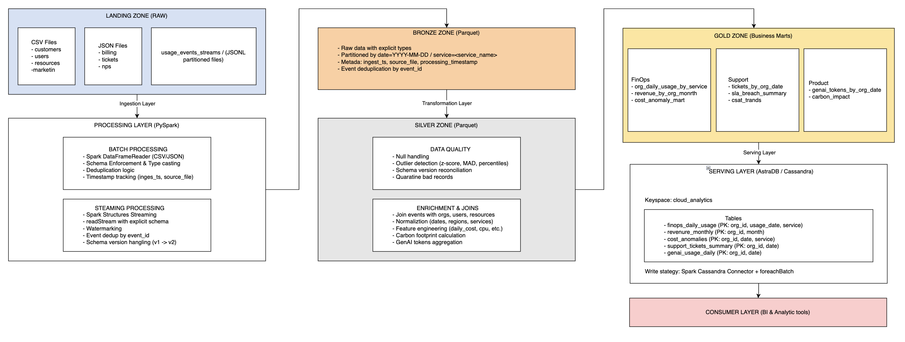
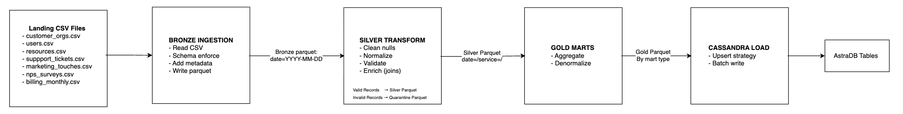
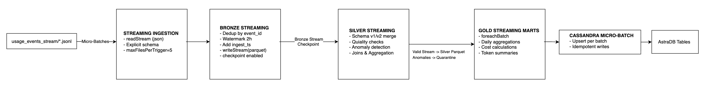

# Diseño Preliminar - Cloud Provider Analytics
## ETL + Streaming + Serving en Cassandra

**Fecha:** 20 de Octubre 2025  
**Versión:** 1.0 - Diseño Preliminar\
**Autor:** Nicolás Rossi

---

## Tabla de Contenidos
1. [Diagrama de Arquitectura de Alto Nivel](#1-diagrama-de-arquitectura-de-alto-nivel)
2. [Mapeo de Requisitos a Componentes](#2-mapeo-de-requisitos-a-componentes)
3. [Flujo de Datos (Data Pipeline)](#3-flujo-de-datos-data-pipeline)
4. [Asunciones y Riesgos Iniciales](#4-asunciones-y-riesgos-iniciales)
5. [Estimación de Esfuerzo y Recursos](#5-estimación-de-esfuerzo-y-recursos)
6. [Anexo A: Tablas Cassandra (Query-First) - Preliminar](#anexo-a-tablas-cassandra-query-first---preliminar)
7. [Anexo B: Decisiones Técnicas y Trade-offs](#anexo-b-decisiones-técnicas-y-trade-offs)

---

## 1. Diagrama de Arquitectura de Alto Nivel

### 1.1 Arquitectura General



### 1.2 Patrón Arquitectónico Elegido: **Lambda Architecture**

**Justificación:**
La arquitectura Lambda se adopta por la coexistencia de dos naturalezas de datos en el proyecto: (i) lotes periódicos y maestros (customers, users, resources, billing, NPS, tickets) cuyo procesamiento óptimo es batch; y (ii) eventos de uso (usage events) que exigen baja latencia y tratamiento continuo vía streaming

1. **Naturaleza Dual de los Datos:**
   - **Batch Layer:** Datos maestros (customers, users, resources) y datos periódicos (billing, NPS, tickets) son inherentemente batch
   - **Speed Layer:** Eventos de uso (`usage_events_stream`) requieren procesamiento near-real-time

2. **Requisitos del Negocio:**
   - FinOps necesita métricas operativas en tiempo real para detección de anomalías
   - Facturación y CRM se actualizan mensualmente/diariamente (batch es suficiente)

3. **Trade-offs Aceptados:**
   - Dos pipelines separados (batch + streaming) vs. uno unificado
   - Complejidad de sincronización en Gold layer
   - Mitigación: Idempotencia garantizada y checkpoint management

**Por qué Lambda y no Kappa (todo streaming):**
- Naturaleza de los datos batch: Re-streamear CSV estáticos (maestros y facturación) añade complejidad operativa sin beneficio: su cadencia diaria/mensual se modela mejor como jobs batch.
- Eficiencia operativa: Mantener un único stream para todo fuerza state management y replay innecesarios; con Lambda, cada dominio usa el modo de cómputo más natural.
- Coste/latencia adecuados: Batch ofrece mayor throughput para reprocesos históricos;

---

## 2. Mapeo de Requisitos a Componentes

### 2.1 Análisis de las 5 Vs del Big Data

| **V**        | **Característica del Proyecto**                                        | **Estrategia de Solución**                                  |
|--------------|------------------------------------------------------------------------|-------------------------------------------------------------|
| **Volume**   | ~100 archivos JSONL particionados, múltiples CSV, crecimiento diario   | Particionado Parquet, procesamiento paralelo con Spark      |
| **Velocity** | Near real-time streaming events + batch diario/mensual                 | Arquitectura Lambda: Streaming + Batch layers               |
| **Variety**  | CSV estructurado, JSONL semi-estructurado, evolución de schema (v1/v2) | Schema enforcement, schema evolution handling, type casting |
| **Veracity** | Nulos, outliers, valores negativos, inconsistencias, ruido             | Data quality rules, quarantine zone, detección de anomalias |
| **Value**    | Insights para FinOps, Soporte, Producto/GenAI                          | Business-oriented marts en Gold zone, query-first design    |

### 2.2 Mapeo de Requisitos Técnicos

| **Requisito del Proyecto**            | **Componente Técnico**          | **Tecnología/Herramienta**                      |
|---------------------------------------|---------------------------------|-------------------------------------------------|
| Procesamiento distribuido de big data | Processing engine               | **PySpark**                                     |
| Ingesta batch de CSV/JSON             | Batch ingestion layer           | `spark.read.csv()`, `spark.read.json()`         |
| Ingesta streaming de eventos          | Streaming ingestion layer       | **Spark Structured Streaming**                  |
| Almacenamiento intermedio escalable   | Bronze/Silver/Gold zones        | **Parquet** (columnar, compressed)              |
| Deduplicación de eventos              | Dedup logic                     | `dropDuplicates(["event_id"])`, watermarks      |
| Manejo de late data                   | Watermarking                    | `withWatermark("event_ts", "2 hours")`          |
| Schema evolution (v1 → v2)            | Schema handling                 | Conditional column addition, `when/otherwise`   |
| Data quality y detección de anomalías | Quality rules engine            | Custom Spark functions                          |
| Normalización y joins                 | Transformation layer (Silver)   | Spark SQL joins                                 |
| Serving layer (queries rápidas)       | NoSQL database                  | **AstraDB (Cassandra)**                         |
| Carga a Cassandra                     | Cassandra connector             | `spark-cassandra-connector` + foreachBatch      |
| Idempotencia en re-procesamiento      | Checkpointing + upsert strategy | Structured Streaming checkpoints, Cassandra PKs |
| Diseño query-first para BI            | Marts denormalizados            | Cassandra table design per query pattern        |

### 2.3 Componentes por Zona del Data Lake

| **Zona**       | **Propósito**                                  | **Formato**    | **Particionamiento**           |
|----------------|------------------------------------------------|----------------|--------------------------------|
| **Landing**    | Archivos raw inmutables                        | CSV, JSONL     | Por fuente (directorio)        |
| **Bronze**     | Datos tipificados con metadata de ingesta      | Parquet        | `date=YYYY-MM-DD`              |
| **Silver**     | Datos limpios, conformados y enriquecidos      | Parquet        | `date=` + `service=`           |
| **Gold**       | Marts analíticos por dominio                   | Parquet        | Por caso de uso                |
| **Quarantine** | Registros rechazados por quality rules       | Parquet        | `date=` + `error_type=`        |

---

## 3. Flujo de Datos (Data Pipeline)

### 3.1 Pipeline Batch (Maestros y Facturación)



### 3.2 Pipeline Streaming (Usage Events)



### 3.3 Transformaciones Clave en Silver Layer

| **Transformación**                  | **Input**                     | **Output**                            | **Lógica**                                               |
|-------------------------------------|-------------------------------|---------------------------------------|----------------------------------------------------------|
 Reconciliación de esquema           | events (v1 y v2)              | unified_events                        | Agregar valores nulos para las columnas faltantes en registros v1 |
| Validación de costos                | cost_usd_increment            | validated_cost + bandera is_anomaly   | Filtrar costos dentro del rango [-0.01, +∞); z-score > 3 → marcar anomalía |
| Imputación de unidad                | value, unit                   | value, unit (completados)             | Si *value* NO es nulo y *unit* es nulo → unit = 'count'  |
| Normalización de servicio           | service (crudo)               | service_normalized                    | Mapear variaciones hacia una taxonomía estándar           |
| Normalización de región             | region (crudo)                | region_code (ISO)                     | Mapear a códigos estándar (us-east-1, eu-west-1, etc.)    |
| Enriquecimiento de organización     | org_id                        | org + industry, plan, region          | *LEFT JOIN* con la tabla **customers_orgs**               |
| Enriquecimiento de usuario          | user_id                       | user + role, status                   | *LEFT JOIN* con la tabla **users**                        |
| Enriquecimiento de recurso          | resource_id                   | resource + type, service              | *LEFT JOIN* con la tabla **resources**                    |
| Agregación de costo diario          | events (horarios)             | org_daily_cost                        | *GROUP BY* org_id, date, service → SUM(cost)              |
| Agregación de tokens GenAI          | events (genai_tokens)         | genai_tokens_daily                    | WHERE service='genai' → SUM(genai_tokens)                 |
| Cálculo de huella de carbono        | events (carbon_kg)            | daily_carbon_footprint                | SUM(carbon_kg) por organización y fecha                   |
| Cálculo de puntaje de anomalía      | cost_usd_increment            | anomaly_score                         | (valor - media) / desviación estándar por org/servicio    |

---

## 4. Asunciones y Riesgos Iniciales

### 4.1 Asunciones

| **ID** | **Asunción**                                                                | **Impacto si es falsa**                                     | **Validación**                          |
|--------|-----------------------------------------------------------------------------|-------------------------------------------------------------|-----------------------------------------|
| A1     | Volumen de eventos < 10M registros/día                                      | Requiere optimización adicional (coalesce, cache)          | Analizar tamaño de archivos landing     |
| A2     | Schema evolution solo 2 versiones (v1 → v2), no más cambios                 | Lógica más compleja de reconciliación                       | Confirmar con stakeholders              |
| A3     | Late data arrival máximo 2 horas después del event_timestamp                | Ajustar watermark (mayor latencia o pérdida de datos)      | Analizar timestamps en archivos         |
| A4     | Archivos JSONL correctamente formateados (un JSON por línea)                | Requiere pre-procesamiento adicional                        | Validar parsing de muestras             |
| A5     | Idempotencia por natural keys (org_id + date + service) es suficiente       | Requiere surrogate keys o versionado                        | Diseñar pruebas de re-ejecución         |

### 4.2 Riesgos

| **ID** | **Riesgo**                                           | **Probabilidad** | **Impacto** | **Mitigación**                                                                 |
|--------|------------------------------------------------------|------------------|-------------|--------------------------------------------------------------------------------|
| R1     | Datos históricos incompletos o inconsistentes       | Alta             | Medio       | EDA exhaustivo, documentar gaps, aplicar reglas de quality estrictas           |
| R2     | Late data > watermark (pérdida de eventos)           | Media            | Medio       | Monitorear late data metrics, alertas, ajustar watermark iterativamente        |
| R3     | Joins con baja cardinalidad (muchos nulls)           | Media            | Medio       | LEFT JOINs + coalesce con defaults, documentar % de matches                    |
| R4     | Outliers extremos distorsionando anomaly detection   | Alta             | Medio       | Usar MAD (más robusto), percentiles, caps en valores extremos                  |

---

## 5. Estimación de Esfuerzo y Recursos

### 5.1 Equipo y Roles

Equipo unipersonal: Nicolás Rossi

| **Rol**           | **Responsabilidades**                                        | **Tiempo Estimado** |
|-------------------|--------------------------------------------------------------|---------------------|
| **Data Engineer** | Arquitectura, Spark streaming, Cassandra design, code review | 40 horas            |
|                   | Batch pipelines, Bronze/Silver transformations               | 20 horas            |
|                   | Gold marts, SQL optimization, business logic,                | 20 horas            |
|                   | EDA, data profiling, testing queries, documentation          | 20 horas            |

**Total Esfuerzo:** ~100 horas (2.5 semanas)


### 5.2 Recursos Técnicos

| **Recurso**                      | **Especificación**                         |
|----------------------------------|--------------------------------------------|
| **Compute**                      | Colab                                      |
| **Storage (Landing)**            | Local filesystem (incluido en Colab)       |
| **Storage (Bronze/Silver/Gold)** | Parquet en Google Drive o Colab local      |
| **Database (AstraDB)**           | Free tier: 40GB, 40M reads, 20M writes/mes |
| **Conectividad**                 | Spark Cassandra Connector (open source)    |

### 5.3 Roadmap y entregables

| **Hito**                   | **Entregable**                                 | **Criterio de Éxito**                                |
|----------------------------|------------------------------------------------|------------------------------------------------------|
| M1: Bronze Complete        | Bronze Parquet (batch + streaming) con metadata | 100% de archivos ingestados, schema validado         |
| M2: Silver Complete        | Silver Parquet con datos limpios y enriquecidos | <10% registros en quarantine, joins con >80% matches |
| M3: Gold Marts             | Marts de FinOps, Soporte, Producto en Parquet  | KPIs calculados correctamente vs. datos raw          |
| M4: Cassandra Integration  | Datos cargados en AstraDB, queries funcionando | 5 queries mínimas ejecutándos                        |
| M5: Testing & Docs         | Tests, documentación completa, demo funcional  | 0 bugs críticos, docs revisadas                      |
| M6: Entrega Final          | Notebook ejecutable, video, presentación       | Todos los requisitos del proyecto cumplidos          |

---

## Anexo A: Tablas Cassandra (Query-First) - Preliminar

### Query 1: Costos y requests diarios por org y servicio en un rango de fechas
```cql
CREATE TABLE cloud_analytics.finops_daily_usage (
    org_id UUID,
    usage_date DATE,
    service TEXT,
    total_cost_usd DECIMAL,
    total_requests BIGINT,
    total_cpu_hours DECIMAL,
    total_storage_gb_hours DECIMAL,
    total_carbon_kg DECIMAL,
    avg_cost_per_request DECIMAL,
    is_anomaly BOOLEAN,
    anomaly_score DOUBLE,
    PRIMARY KEY ((org_id), usage_date, service)
) WITH CLUSTERING ORDER BY (usage_date DESC, service ASC);
```

### Query 2: Top-N servicios por costo acumulado (últimos 14 días)
```cql
CREATE TABLE cloud_analytics.org_service_cost_summary (
    org_id UUID,
    summary_date DATE,
    service TEXT,
    cost_14d DECIMAL,
    cost_7d DECIMAL,
    cost_1d DECIMAL,
    rank_14d INT,
    PRIMARY KEY ((org_id, summary_date), rank_14d, service)
) WITH CLUSTERING ORDER BY (rank_14d ASC);
```

### Query 3: Evolución de tickets críticos y SLA breach
```cql
CREATE TABLE cloud_analytics.support_tickets_summary (
    org_id UUID,
    ticket_date DATE,
    severity TEXT,
    total_tickets INT,
    sla_breach_count INT,
    sla_breach_rate DECIMAL,
    avg_csat DECIMAL,
    PRIMARY KEY ((org_id), ticket_date, severity)
) WITH CLUSTERING ORDER BY (ticket_date DESC);
```

### Query 4: Revenue mensual con créditos/impuestos
```cql
CREATE TABLE cloud_analytics.revenue_monthly (
    org_id UUID,
    billing_month TEXT,  -- YYYY-MM
    gross_revenue_usd DECIMAL,
    credits_applied_usd DECIMAL,
    taxes_usd DECIMAL,
    net_revenue_usd DECIMAL,
    currency_original TEXT,
    fx_rate DECIMAL,
    PRIMARY KEY ((org_id), billing_month)
) WITH CLUSTERING ORDER BY (billing_month DESC);
```

### Query 5: Tokens GenAI y costo estimado por día
```cql
CREATE TABLE cloud_analytics.genai_usage_daily (
    org_id UUID,
    usage_date DATE,
    total_tokens BIGINT,
    total_requests INT,
    total_cost_usd DECIMAL,
    avg_tokens_per_request INT,
    PRIMARY KEY ((org_id), usage_date)
) WITH CLUSTERING ORDER BY (usage_date DESC);
```

---

## Anexo B: Decisiones Técnicas y Trade-offs

| **Decisión**                                                      | **Alternativa considerada**                                         | **Trade-off**                                                                    | **Justificación técnica**                                                                                                                                                                                                     |
| ----------------------------------------------------------------- | ------------------------------------------------------------------- | -------------------------------------------------------------------------------- | ----------------------------------------------------------------------------------------------------------------------------------------------------------------------------------------------------------------------------- |
| **Patrón arquitectónico: Lambda vs. Kappa**                       | Kappa (todo *streaming*)                                            | Complejidad operativa vs. unificación de lógica                                  | Los datos maestros y de facturación son naturalmente *batch*; procesarlos como *streaming* generaría sobrecarga innecesaria. Lambda mantiene ambos mundos con pipelines especializados y coherentes.                          |
| **Método de detección de anomalías: Z-score vs. MAD**             | IQR (*Interquartile Range*), *Isolation Forest*                     | Precisión estadística vs. simplicidad de implementación                          | *Z-score* es sensible a valores extremos; MAD (*Median Absolute Deviation*) es más robusto ante outliers y fácil de mantener en Spark. Se adoptó MAD para estabilidad y bajo costo computacional.                             |
| **Ventana de watermark: 2 h vs. 6 h**                             | Aumentar a 6 h para mayor tolerancia a *late data*                  | Menor latencia vs. mayor cobertura temporal                                      | Dos horas equilibran la necesidad de *near real-time* con la gestión razonable de llegadas tardías, evitando retener estados excesivos en memoria.                                                                            |
| **Esquema de particionamiento: `date + service` vs. solo `date`** | Particionar únicamente por `date`                                   | Mayor granularidad de lectura vs. incremento de archivos pequeños                | Incluir `service` mejora el *filter pushdown* en consultas por servicio, reduciendo I/O. La compactación programada mitiga el aumento de *small files*.                                                                       |
| **Persistencia en Cassandra: TTL y Compaction**                   | Sin TTL o compaction manual                                         | Retención prolongada vs. limpieza automática                                     | Se aplica TTL de 90 días y estrategia *Leveled Compaction* para balancear almacenamiento y rendimiento, acorde al ciclo analítico del proyecto.                                                                               |
